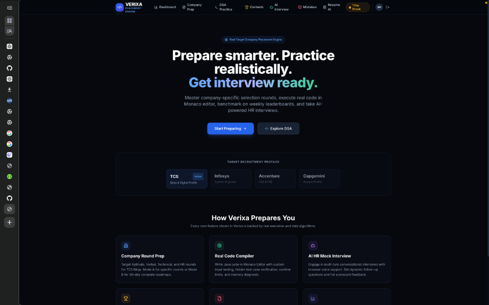
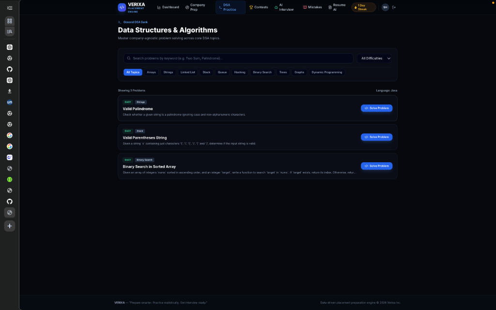
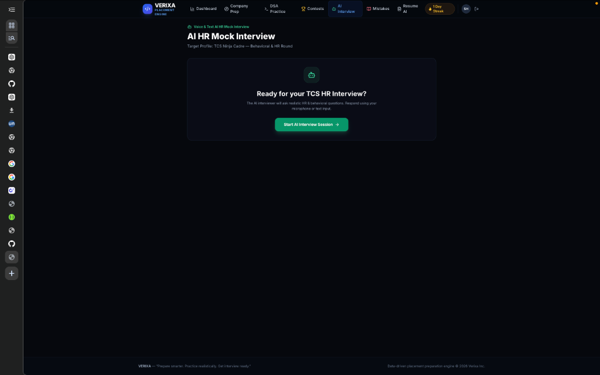
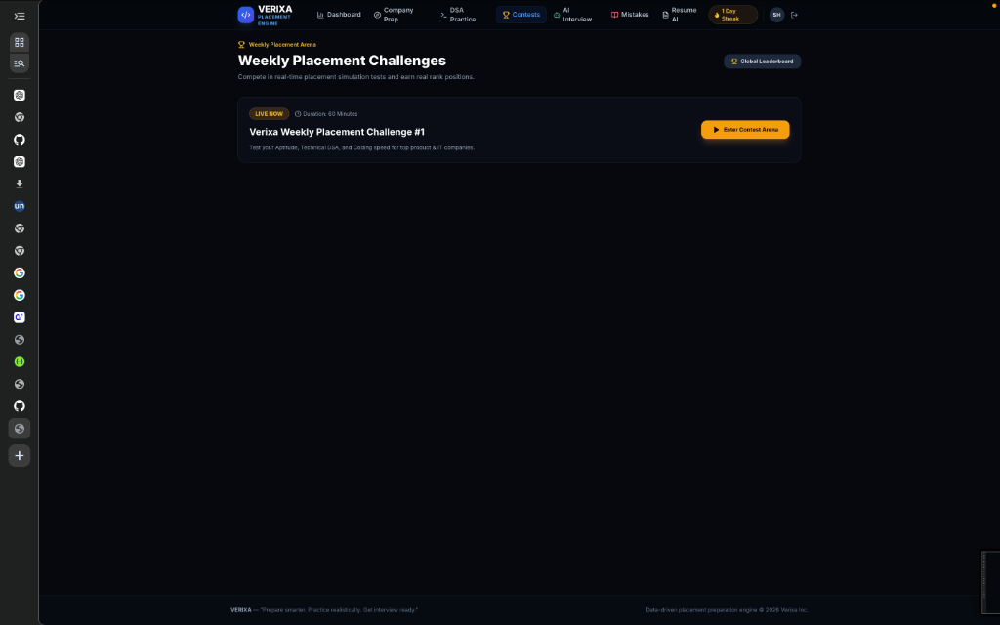

# 🚀 VERIXA — Smart AI-Powered Placement & Technical Interview Platform

> Prepare smarter. Practice realistically. Get interview ready

VERIXA is an enterprise-grade placement preparation platform designed to help students and candidates prepare for top product and IT recruitment drives (such as TCS Ninja/Digital, Product Companies, and Tech Roles). It combines target-company roadmaps, sandboxed Java code execution, voice-supported AI HR mock interviews, resume skill gap analysis, and real-time performance analytics.

---

## 📸 Application Screenshots

### 🏠 Landing & Placement Engine Overview


---

### 💻 Data Structures & Algorithms Practice Bank


---

### 🎙️ AI HR Voice & Text Mock Interview Session


---

### 🏆 Live Weekly Placement Contest Arena


---

## 🌟 Key Features

### 🏢 1. Target Company & Role Preparation Engine
- **Cadre Selection**: Prepare specifically for target companies and profiles (e.g., TCS Ninja Cadre).
- **Round-by-Round Breakdown**: Practice by Aptitude, Logical Reasoning, Verbal, Coding, Technical, and HR rounds.
- **30-Day Preparation Roadmaps**: Interactive daily milestone tracking and task schedules.

### 📝 2. Multi-Category Practice Bank & Interactive Arena
- **Rich Question Bank**: Comprehensive seed bank covering:
  - **Quantitative Aptitude**: Work & Time, Speed/Distance, Percentages, Profit & Loss.
  - **Logical Reasoning**: Number Series, Syllogisms, Coding-Decoding.
  - **Verbal Ability**: Subject-Verb Agreement, Error Spotting, Reading Comprehension.
  - **Core CS Subjects**: Java OOPs & Memory Management, DBMS & SQL Joins, Operating Systems (Deadlocks), Computer Networks.
- **Interactive MCQ Arena**: Option selection, instant grading (+10 marks), detailed explanations, and option breakdowns.
- **Integrated VERIXA AI Assistant**: Get instant hints, concept explanations, and problem breakdowns directly inside practice pages.

### 💻 3. DSA & Coding Problem Compiler
- **Monaco Code Editor**: Professional in-browser code editor with syntax highlighting for Java 21.
- **Isolated Sandbox Runner**: Sandboxed Java compilation and process execution with runtime limit (4s timeout) and memory limits.
- **Test Case Validation**: Run against sample test cases and submit against hidden test cases.

### 🎙️ 4. Voice & Text AI HR Mock Interview Session
- **Real-Time AI Interviewer**: Behavioral and HR mock interview sessions with turn-by-turn question generation.
- **Speech-to-Text & Text-to-Speech**: Respond using microphone input (Web Speech API) and listen to audio question prompts.
- **Turn-by-Turn Feedback**: Immediate communication, clarity, and relevance scores after every response.
- **Final Evaluation Scorecard**: Overall match score (0-100), strengths highlighted, and STAR method improvement recommendations.

### 📄 5. AI Resume Technical Analyzer
- **PDF Resume Parsing**: Automated text extraction from PDF resumes using Apache PDFBox.
- **Skill Gap Analysis**: Extracts strong technical skills and identifies missing keywords against target job roles.
- **Strategic Recommendations**: Personalized recommendations to boost resume ATS score and interview shortlist chances.

### 🏆 6. Weekly Placement Contest Arena & Leaderboard
- **Live Timed Challenges**: 60-minute countdown timer with automated scoring for MCQs and text solutions.
- **Real-Time Leaderboards**: Ranked leaderboard based on score, accuracy percentage, and completion time.

### 📓 7. Personal Mistakes Revision Notebook
- **Automated Tracking**: Failed attempts automatically populate the mistake notebook.
- **Retry & Mastery**: Re-attempt questions until latest result is correct to mark as "Mastered".

### 📊 8. Deterministic Interview Readiness Index
- **Formula-Based Readiness Score**:
  $$\text{Readiness} = (0.25 \times \text{Tech}) + (0.25 \times \text{Coding}) + (0.15 \times \text{Quant}) + (0.15 \times \text{HR}) + (0.10 \times \text{Contests}) + (0.10 \times \text{Streak})$$
- **Recharts Performance Matrix**: Topic mastery breakdown, overall accuracy trends, and skill metrics.

---

## 🛠️ Technology Stack

### **Backend (Spring Boot REST API)**
- **Java 21** / **Spring Boot 3.3.4**
- **Spring Security** with **JWT Authentication**
- **Spring Data JPA** & **Hibernate**
- **H2 In-Memory Database** (PostgreSQL compatible mode) / **PostgreSQL**
- **Flyway Database Migrations** (`V1__init_schema.sql`, `V2__seed_data.sql`)
- **Apache PDFBox** for PDF text extraction
- **Spring Kafka** for event publishing
- **OpenAPI 3 / Swagger UI** documentation

### **Frontend (React Single Page Application)**
- **React 18** with **TypeScript**
- **Vite 5** (Fast HMR & build runner)
- **Tailwind CSS** (Custom dark-mode glassmorphic theme)
- **Monaco Editor (`@monaco-editor/react`)**
- **Recharts** (Interactive performance charts)
- **Lucide React** (Modern iconography)
- **Axios** (REST API client with JWT interceptors)

---

## 📁 Repository Structure

```
Verixa/
├── src/main/java/com/sv/verixa/
│   ├── ai/               # AI Chat & LLM Integration Services
│   ├── auth/             # Authentication, JWT, Users & Streaks
│   ├── codeexecution/    # Sandbox Java Code Compiler & Submission
│   ├── company/          # Companies, Job Roles, and Profiles
│   ├── contest/          # Contest Arena, Submissions & Rules
│   ├── interview/        # Voice/Text AI HR Mock Interview Engine
│   ├── leaderboard/      # Leaderboard Rankings & Scores
│   ├── practice/         # Question Attempt & Mistakes Notebook
│   ├── progress/         # Readiness Index & Skill Analytics
│   ├── question/         # Question Bank, Options & Test Cases
│   ├── resume/           # Resume Upload & PDF Skill Extraction
│   └── roadmap/          # 30-Day Preparation Roadmaps
├── src/main/resources/
│   ├── application.yml   # Application Config (Port, DB, JWT, AI)
│   └── db/migration/     # Flyway SQL Migration Scripts (V1 & V2)
├── frontend/
│   ├── src/
│   │   ├── components/   # App Layout, Navigation Bar, Cards
│   │   ├── context/      # AuthContext & State Management
│   │   ├── pages/        # Dashboard, CompanyPrep, Practice, CodingArena, etc.
│   │   ├── services/     # Axios API Client (`api.ts`)
│   │   └── types/        # TypeScript Interfaces & Models
│   ├── package.json
│   └── vite.config.ts
├── docker-compose.yml    # Docker Infrastructure (PostgreSQL, Kafka, Zookeeper)
├── Dockerfile            # Container definition for Spring Boot Backend
└── pom.xml               # Maven Dependencies & Build Config
```

---

## 🚦 Quick Start Guide

### Prerequisites
- **Java 21 JDK**
- **Node.js (v18+) & npm**
- **Maven** (or use included `./mvnw`)

### 1. Start the Backend (Spring Boot API)
```bash
# Clone the repository
git clone https://github.com/Shivam8761/Verixa.git
cd Verixa

# Run Spring Boot backend
./mvnw spring-boot:run
```
> The backend server will start on **`http://localhost:8080`**.  
> Database H2 Console: `http://localhost:8080/h2-console` (JDBC URL: `jdbc:h2:mem:verixa_db`, User: `sa`)  
> Swagger UI API Docs: `http://localhost:8080/swagger-ui.html`

### 2. Start the Frontend (Vite + React)
```bash
cd frontend

# Install dependencies
npm install

# Start Vite development server
npm run dev
```
> Access the web application at **`http://localhost:3000`**.

---

## ⚡ API Endpoints Summary

| Module | Endpoint | Method | Description |
| :--- | :--- | :--- | :--- |
| **Auth** | `/api/auth/register` | `POST` | Register a new user |
| **Auth** | `/api/auth/login` | `POST` | Authenticate & get JWT token |
| **Prep Engine** | `/api/companies` | `GET` | List target companies |
| **Questions** | `/api/questions` | `GET` | Filter questions by company, role, round, or topic |
| **Practice** | `/api/questions/{id}/attempt` | `POST` | Submit MCQ or Text question attempt |
| **Compiler** | `/api/code/execute` | `POST` | Run Java code against custom input |
| **Compiler** | `/api/code/submit` | `POST` | Submit Java solution against hidden test cases |
| **AI Interview**| `/api/interviews` | `POST` | Start a new AI HR mock interview session |
| **AI Interview**| `/api/interviews/{id}/answer` | `POST` | Submit interview response & receive evaluation |
| **Resume** | `/api/resume/analyze` | `POST` | Upload PDF resume for skill gap analysis |
| **Progress** | `/api/progress` | `GET` | Get deterministic readiness score & topic matrix |

---

## 📜 License
Developed for placement preparation. Free to use and customize.
